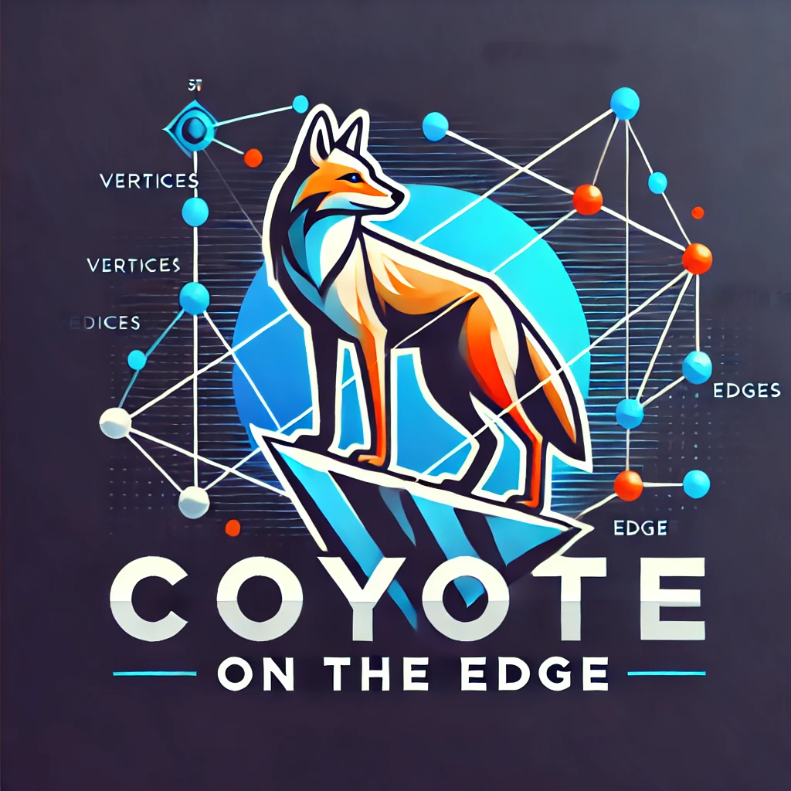

## Coyote on the Edge

Coyote on the Edge (COTE) is a weekly seminar on graph theory and related topics at [California State University San Bernardino](https://www.csusb.edu/mathematics) organized by Jeremy Aikin, Gabriel Elvin, Cory Johnson, and Youngsu Kim.

---

### Schedule

- 10/29/2024: *Ramsey Theory: Graphs, Equations, and Rainbows* by Gabriel Elvin,  [slides](./slides/10_29_2024-gabriel.pdf)
- 11/05/2024: *When Graphs Meet Matrices* by Youngsu Kim, [slides](./slides/11_05_2024-youngsu.pdf)
- 11/12/2024: *Graphs, Vectors, and Geometries* by Jeremy Aikin, [slides](./slides/11_12_2024_jeremy.pdf)
- 11/19/2024: *Exercise day*